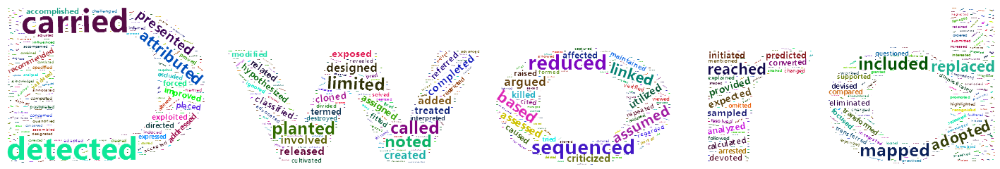
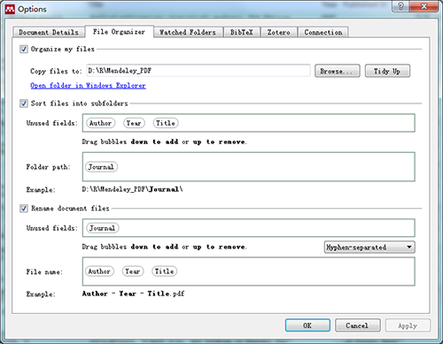

# dword

> This package is designed for those people who often search some special words/concepts/informations within a huge pile of references, and get the responding sentences/papers/origins. Or if you're not a native English users, you want to know how to use a word or a word's usage frequence.你是不是像我一样学习了一些文献，但当需要引用的时候忘了是哪一篇？你是不是像我一样对有些概念不太熟悉但去网上搜的结果又不是太满意？你是不是像我一样不清楚一个单词的用法是不是合适？你是不是像我一样有时候想知道优秀文章用了哪些词汇，然后想学习一下？借助一些给力的程序，我写了一些函数来解决我的问题，如果你像我一样遇到了上面的一些问题，又没有有效的解决方法时，推荐你用一下。你不需要会太多`R`技巧也能轻松使用。

`{dword}` can

- extract sentences with your keywords from a local database.

- report word frequencies.

- paint word cloud.

- ...



## Install

```{r, eval = FALSE}
devtools::install_github("dong87/dword")
```

## install depended packages

```{r}
install.packages("tidyverse", "stringi", "koRpus", "wordcloud2", "quanteda", "htmlwidgets")
```

---

1. Firstly, let me assume you're a academic researcher. You read a lot of papers in every single day. The papers are `PDF` format and are managed in [Mendeley](https://www.mendeley.com/). Mendeley was configured as:



2. You'd better to transfer those PDFs to `TXT` to facilitate `R` operation. The tool to be used is [pdftotxt](https://github.com/dong87/dword/blob/master/exe/pdftotext.exe) . You must download it from the link to a direction on you computer. **Note:** Space is NOT allowned in the direction. This transference will be implemented automatically with the function I've written.

3. The TXTs we got in the last step will be slipted to single sentences, the elements of the databese what we need.

4. Finally, we can do extracting-realated jobs! Enjoy it!

## Tutorial 

[https://github.com/dong87/dword/wiki](https://github.com/dong87/dword/wiki)

## Feedbacks and enhancement

You've found a bug, or have an enhancment idea? Feel free to open an issue : [https://github.com/dong87/dword/issues](https://github.com/dong87/dword/issues). 
